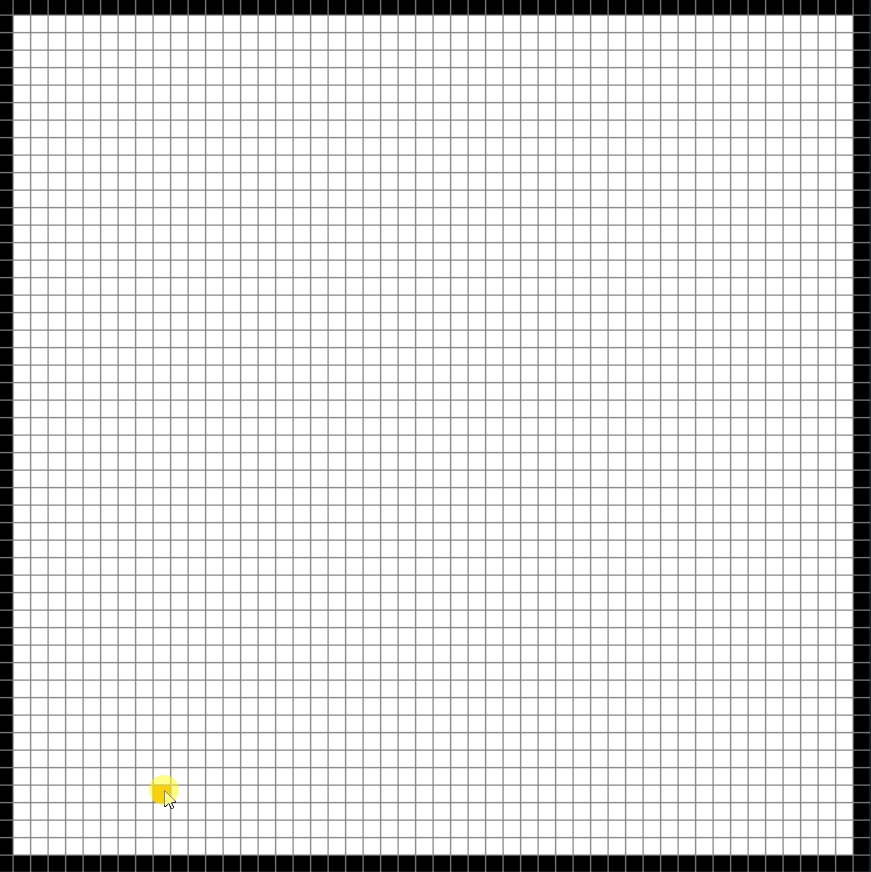
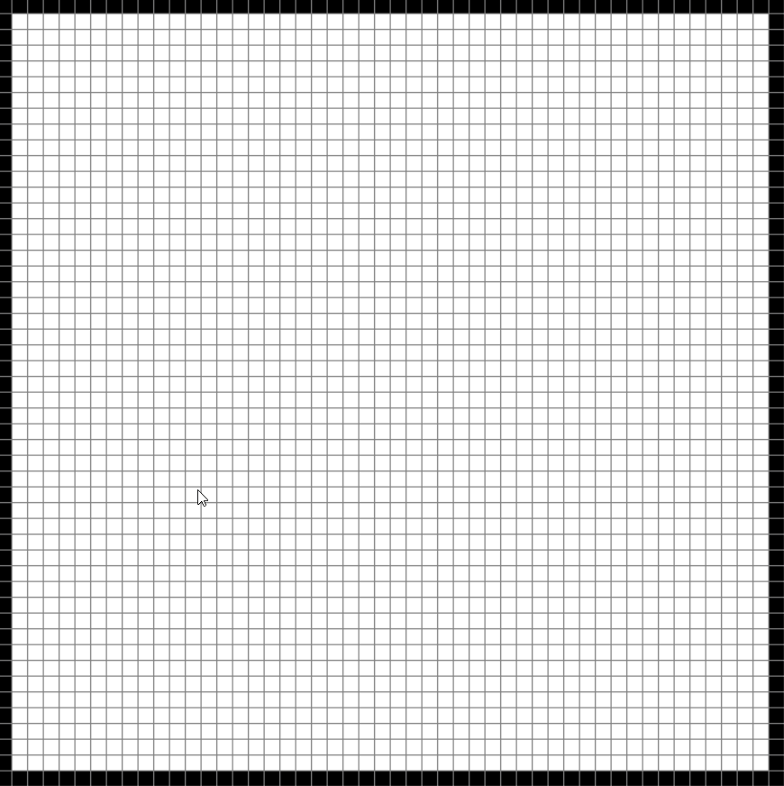

# Maze And PathFinding Visualizer

## Project Description
An Interactive Visualizer built using Python to help understand the process of path finding and maze generation algorithms. This application supports path finding alogrithms
such as Dijkstra, A* and DFS. Random DFS was used for maze generation allowing path finding algortihms to be tested under complex maps.
The application allows the user to place start and end nodes, while also having the ability to create walls on the map.
 
 

Demo (Dijkstra's Algorithm):

 
 

Demo (Random Maze with A* Algorithm):

 
 

Application Keybord Controls:
- First select start and end nodes (Left mouse click)
- Add Walls (Left mouse click after adding start and end nodes)
- Press **_Space-bar_** to run Dijkstra's algorithm
- Press **_A_** to run A* algorithm
- Press **_M_** to generate a random maze
- Press **_C_** to clear the grid
- Press **_D_** to run DFS algorithm
